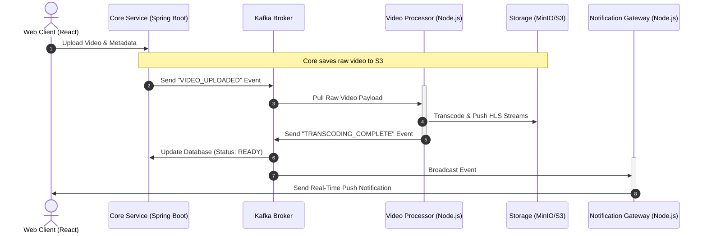

# nexuSTream

An end-to-end, event-driven Video on Demand (VOD) streaming platform built with a microservices architecture. The platform supports multi-bitrate HLS transcoding, asynchronous event processing, real-time status updates, and scalable token validation.

---

## 🏗 System Architecture & Workflow

The architecture is entirely decoupled, leveraging **Apache Kafka** for asynchronous event messaging and **Redis** for lightweight state tracking.



---

## 🛠️ Tech Stack

| Layer | Technologies |
|-------|--------------|
| **Frontend** | React (Vite), Tailwind CSS, Hls.js |
| **Backend** | Spring Boot (Java), Node.js (Express) |
| **Event Streaming** | Apache Kafka |
| **Caching** | Redis |
| **Storage** | Cloudfare R2 |
| **Processing** | FFmpeg |

---

## 📂 Repository Structure

```text
nexus-video-vod/
├── infrastructure/
│   └── nginx/                 # Nginx reverse proxy
├── redis/                     # Token denylist & session store
└── services/
    ├── core-service/          # Spring Boot - Auth & metadata
    │   ├── src/main/java/
    │   └── pom.xml
    ├── video-processor/       # Node.js - FFmpeg transcoding
    │   ├── src/workers/
    │   └── package.json
    ├── notification-gateway/  # Node.js - WebSocket gateway
    │   ├── src/middleware/
    │   ├── src/kafka/
    │   └── package.json
    └── web-client/            # React - Frontend UI
        └── src/components/
```

---

## 🔒 Security & Token Verification Lifecycle

| Step | Action |
|------|--------|
| **1. Issue** | `web-client` authenticates with `core-service` → receives JWT |
| **2. Cache** | JWT stored in Redis (active/blacklisted tokens) |
| **3. Validate** | `notification-gateway` queries Redis during WebSocket handshake |
| **4. Reject/Refresh** | If token invalid/expired, gateway triggers refresh prompt |

---

## 🎥 Video Delivery Details

| Feature | Implementation |
|---------|----------------|
| **HLS Transcoding** | FFmpeg generates multi-bitrate HTTP Live Streaming segments |
| **Adaptive Streaming** | Video.js loads `.m3u8` manifest, adjusts quality based on bandwidth |
| **Event Flow** | Upload → Kafka → Transcode → HLS → Notification → Playback |

---

## 🚀 Quick Start

```bash
# Clone repository
git clone https://github.com/supracoder19/nexuSTream

# Start services with Docker Compose
docker-compose up -f compose-dummy.yaml -d

```

---