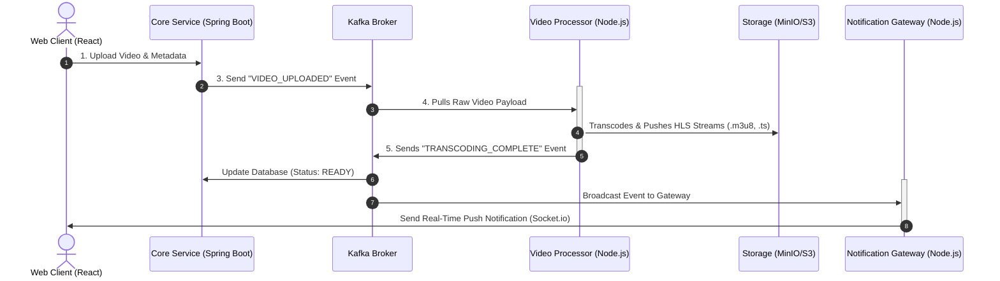

```markdown
# nexuSTream

An end-to-end, event-driven Video on Demand (VOD) streaming platform built with a microservices architecture. The platform supports multi-bitrate HLS transcoding, asynchronous event processing, real-time status updates, and scalable token validation.

---

## 🏗 System Architecture & Workflow

The architecture is entirely decoupled, leveraging **Apache Kafka** for asynchronous event messaging and **Redis** for lightweight state tracking.

# nexuSTream

An end-to-end, event-driven Video on Demand (VOD) streaming platform built with a microservices architecture. The platform supports multi-bitrate HLS transcoding, asynchronous event processing, real-time status updates, and scalable token validation.

---

## 🏗 System Architecture & Workflow

The architecture is entirely decoupled, leveraging **Apache Kafka** for asynchronous event messaging and **Redis** for lightweight state tracking.


---

## 📂 Repository Structure

```text
nexus-video-vod/
├── infrastructure/nginx/      # Nginx Routing Proxy
├── redis/                     # Token Denylist & Session Store
└── services/
    ├── core-service/          # SPRING BOOT: Auth & Metadata DB Writer
    │   ├── src/main/java/     # Core Application Logic
    │   └── pom.xml            # Maven Dependencies
    │
    ├── notification-gateway/  # NODE.JS: Socket.io WS Gateway
    │   ├── src/middleware/    # Token validation via Redis
    │   ├── src/kafka/         # Event Consumers
    │   └── package.json       # Node Dependencies
    │
    └── web-client/            # REACT: Frontend UI (Vite)
        └── src/components/    # VideoUploader & HLS VideoPlayer

```

---

## 🔒 Security & Token Verification Lifecycle

To scale real-time traffic effortlessly, authentication processing is split between services:

1. **Issue:** The `web-client` authenticates directly against the Spring Boot `core-service`, which generates a cryptographically signed JSON Web Token (JWT).
2. **Cache:** Active or blacklisted token records are maintained in a shared, high-performance **Redis** cache instance.
3. **Validate:** When a persistent WebSocket handshake hits the Node.js `notification-gateway`, its `auth.middleware.js` queries **Redis** directly to evaluate the token's validity. If the signature is expired or blocked, it triggers a refresh prompt sequence back to the frontend.

---

## 🎥 Video Delivery Details

* **HLS Transcoding:** The raw input uploads are picked up by the execution worker layout, generating dynamic multi-bitrate HTTP Live Streaming segments via a wrapper running **FFmpeg**.
* **Adaptive Streaming UI:** The web client loads stream segments incrementally tracking the video's index `.m3u8` manifest file, scaling resolution dynamically based on network bandwidth constraints.


```